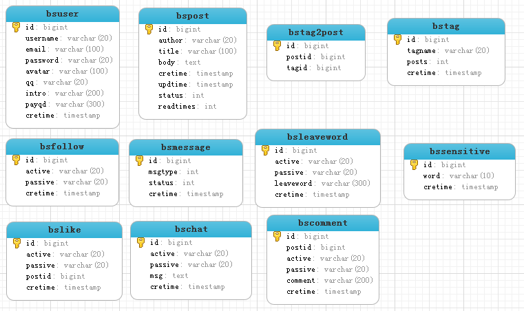

##Niit Blog System
前台框架：Bootstrap

后台框架：SpringMVC,Spring,Mybatis,MySQL
####需求
* 访客：阅读博文，评论博文，对博主留言，关注博主，私信，点赞，打赏
* 博主：发表、编辑、删除、浏览博文，分类归档博文，评论管理，留言管理，个人信息维护，对其他博主的关注
* 管理员：用户管理、博文管理，敏感信息过滤
####非功能性需求
* 预防SQL注入
* 预防XSS攻击
####数据库设计

####用户模块
* 注册
* 登录
* 验证
* 博文
* 评论
* 留言
* 关注
* 私信
* 点赞
* 打赏
* 个人信息维护
####管理员模块
* 用户管理
* 博文管理
* 敏感信息管理
####用户接口
#####注册
1. 注册用户 #post

/user/register (request:UserPojo)
#####登录
1. 登录 #post

/user/login (request:username,password)

2. 登出 #get

/user/logout
#####验证
1. 检查用户名或邮箱是否有效或已存在 #get

/user/check_valid  (request:str,type)

2. 发邮箱验证码   #post

/user/send_email_vericode  (request:email)

3. 校验验证码    #post

/user/veri_email_vericode  (request:vericode)
#####博文
1. 发表博文 #post

/post/create (request:author,title,body,status,tags)

2. 删除博文 #post

/post/del (request:id)

3. 更新博文 #post

/post/update (request:PostPojo)

4. 查看博文 #get

/post/view/?

5. 查看博文列表   #get

/post/list  (request:author,pageNum,pageSize,orderBy)
#####评论
1. 发表评论 #post

/comment/create     (request:postid,active,passive,comment)

2. 删除评论  #post

/comment/del    (request:id)

3. 查看评论  #get

/comment/list   (request:postid,pageNum,pageSize)

#####留言
1. 留言   #post

/leaveword/create   (request:active,passive,leaveword)

2. 查看留言 #post

/leaveword/view/?
    
3. 删除留言 #post

/leaveword/del  (request:id)
#####私信
1. 发私信  #post

/chat/send  (request:active,passive,msg)

2. 查看私信 #post

/char/list  (request:active,passive,pageNum,pageSize)
#####点赞
1. 点赞   #post

/post/create_like  (request:active,passive,postid)

2. 查看点赞  #get

/post/list_like (request:passive,postid,pageNum,pageSize)
#####个人信息
1. 查看别人信息   #get

/user/view/?

2. 查看个人信息   #get

/user/view_myself

3. 修改个人信息   #post

/user/update  (request:UserPojo)

4. 重置密码 #post

/user/reset_password  (request:password)
#####用户管理
1. 添加用户     #post

/manage/user/add    (request:UserPojo)

2.删除用户  #post

/manage/user/del    (request:id)

3.查看用户列表    #post

/manage/user/list   (request:fuzzy,pageNum,pageSize,orderBy)
#####博文管理
1. 添加管理员博文(通知博文)    #post

/manage/post/create     (request:author,title,body,status,tags)

2. 删除博文 #post

/manage/post/del    (request:id)

3. 修改博文状态   #post

/manage/post/status     (request:id,status)

4. 查看博文列表   #post

/manage/post/list   (request:author,tags,pageNum,pageSize,orderBy)

#####敏感信息管理
1. 添加敏感信息   #post

/manage/sensitive/create (request:word)

2. 删除敏感信息   #post

/manage/sensitive/del (request:id)

3. 查看敏感信息表  #post

/manage/sensitive/list (request;pageNum,pageSize)